# EasyObs

**AI Observability & Evaluation Platform** — Trace every LLM call, evaluate output quality at scale, and ship reliable AI products with confidence.

OpenAPI · SQLite / Postgres · Object-first Blob (Local / S3 · Azure · GCS) · OTLP/HTTP ingest

Free and open-source under the **MIT License** — use freely for personal projects, startups, and enterprises alike.

---

## Key Features

### Dashboard & Metrics

Monitor request volume, token usage, cost, and latency across all AI services at a glance.

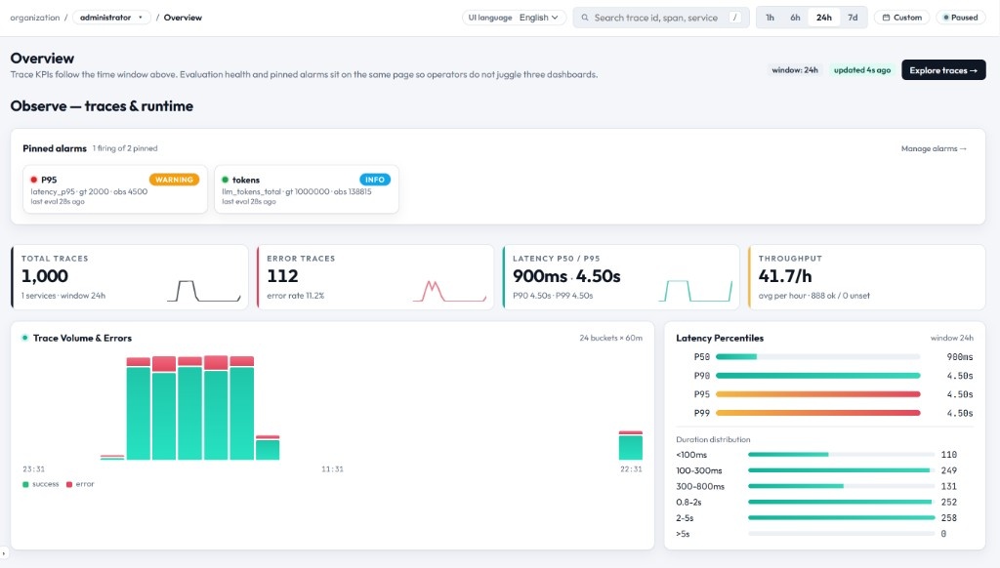

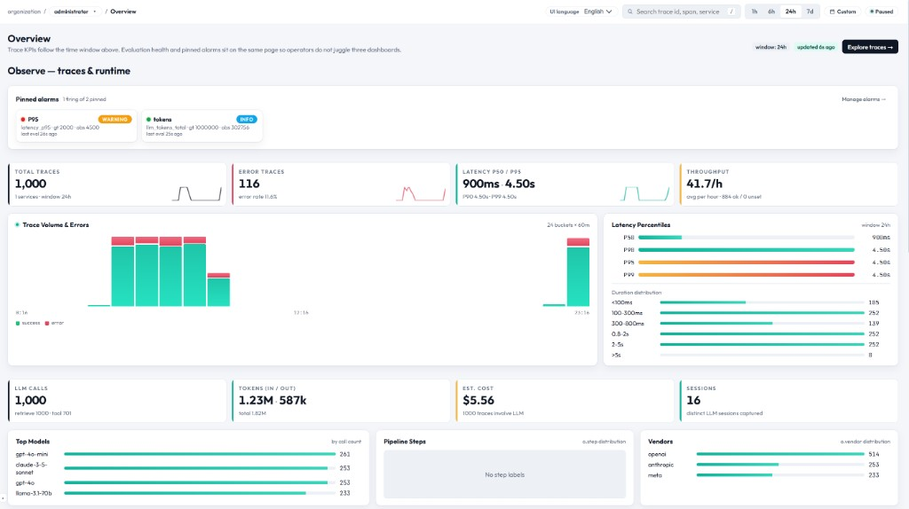

### Tracing

Track the full lifecycle of LLM calls and inspect input/output/metadata at the individual span level.

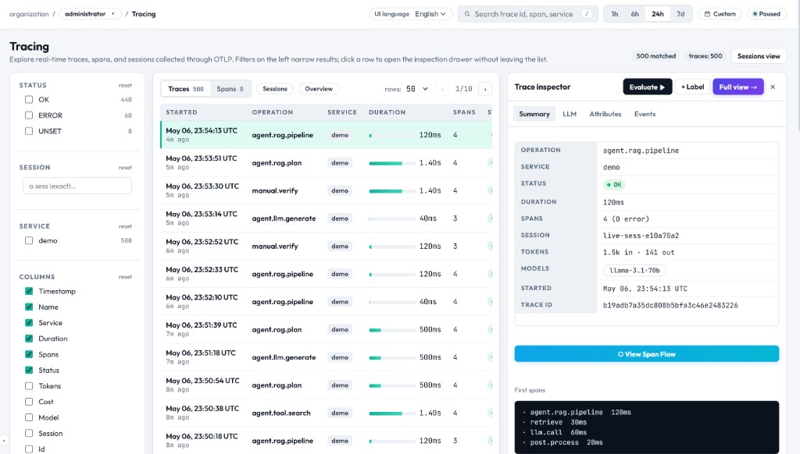

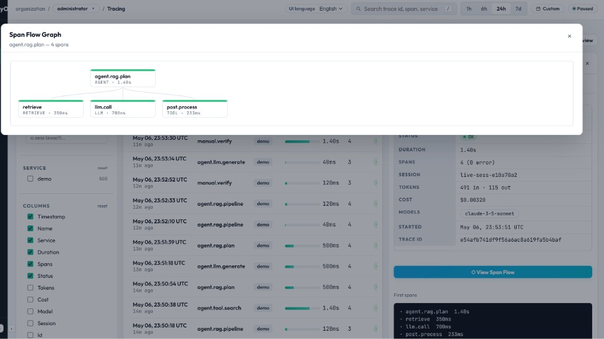

### Quality & Evaluation

Production-grade AI evaluation framework built directly into your observability stack. No separate tools needed.

**Evaluation Profiles** — Combine rule-based checks, multi-LLM judge panels, and human-labeled golden sets into a single evaluation profile. Run them on-demand or automatically on every ingest.

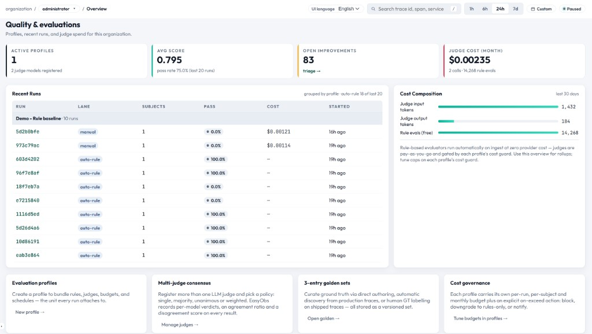

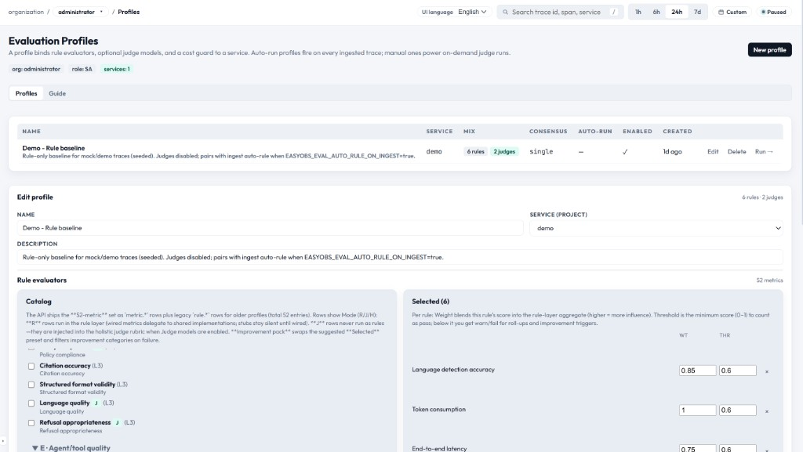

**Multi-LLM Judge Consensus** — Use multiple LLM providers (OpenAI, Anthropic, Google) as judges with configurable consensus policies (majority vote, unanimous, weighted). Built-in cost guards prevent budget overruns with per-run, per-subject, and monthly spending limits.

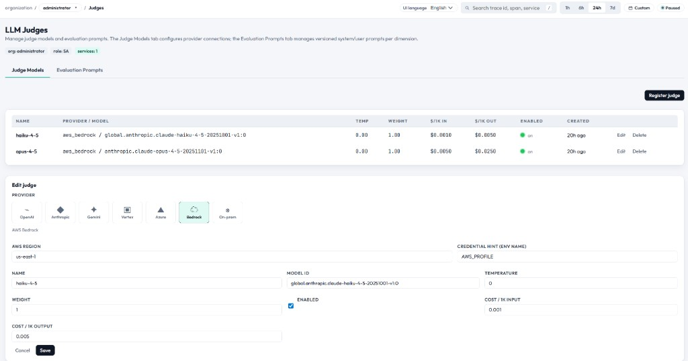

**Evaluation Runs** — Launch evaluations against live traces or golden sets. Track pass/fail rates, score distributions, and cost per evaluation run. Compare runs over time to detect quality regressions.

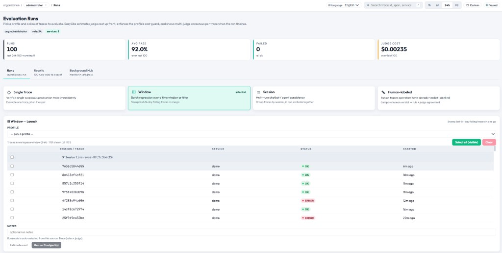

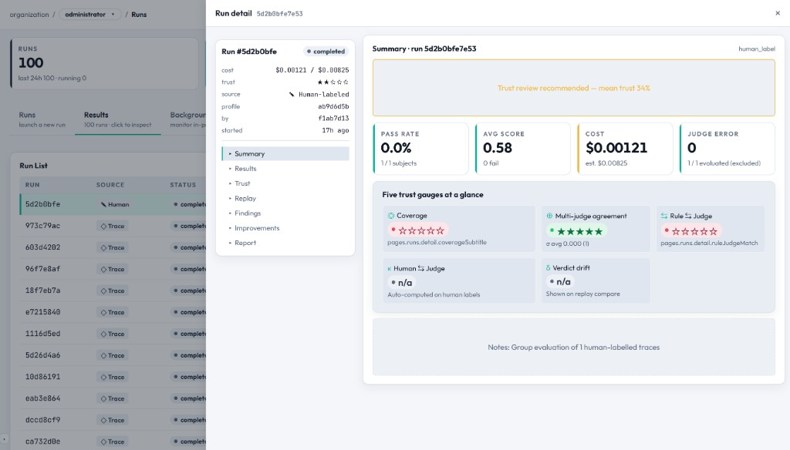

**Golden Sets** — Curate ground-truth datasets from manual labels, generated candidates, or trace captures. Upload via UI (Excel/CSV) or API. Use for regression testing and judge calibration.

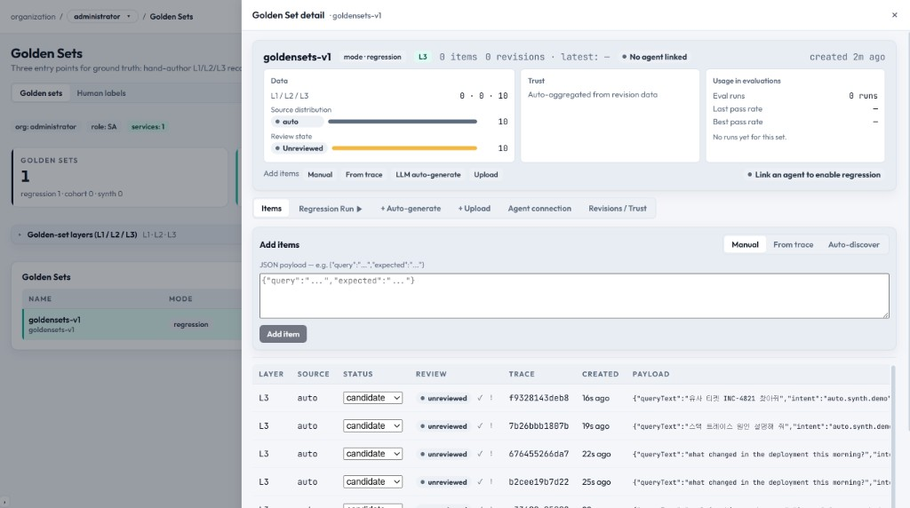

**Improvement Recommendations** — Low scores are automatically mapped to a catalogued set of metrics and categories with effort hints, so teams know exactly what to fix and how hard it is.

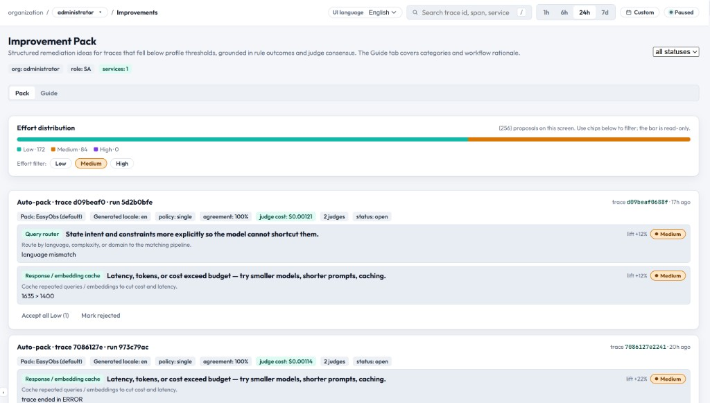

| Capability | Description |
|------------|-------------|
| Auto-rule on ingest | Fire-and-forget rule evaluation on every incoming trace |
| Multi-provider judges | OpenAI, Anthropic, Google Gemini, AWS Bedrock |
| Consensus policies | Majority vote, unanimous, weighted, custom threshold |
| Cost guard | Per-run / per-subject / monthly budget limits |
| Golden set management | Manual, generated, trace-labeled entries with Excel upload |
| Improvement catalog | Metrics → categories → effort hints for actionable fixes |

### Interactions & Sessions

Track per-user sessions and interaction history to analyze usage patterns.

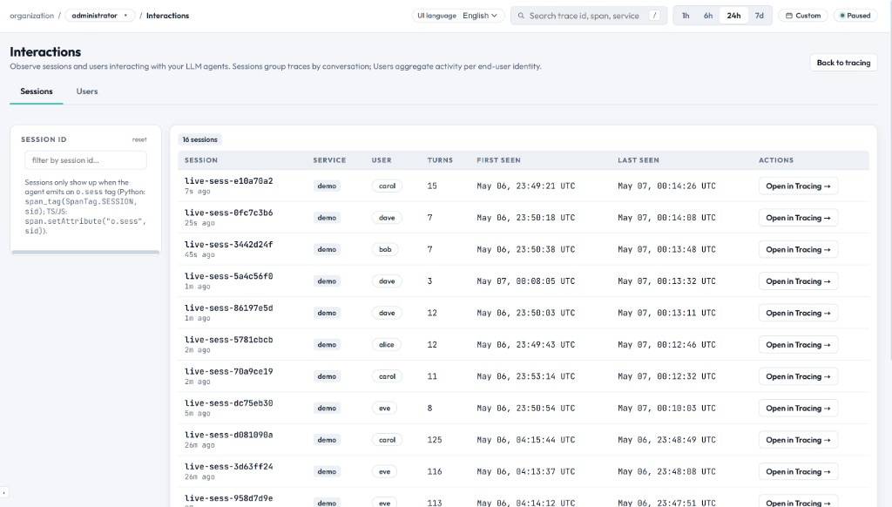

### Alarms & Channels

Configure anomaly detection alerts and deliver notifications via Slack, Webhook, and more.

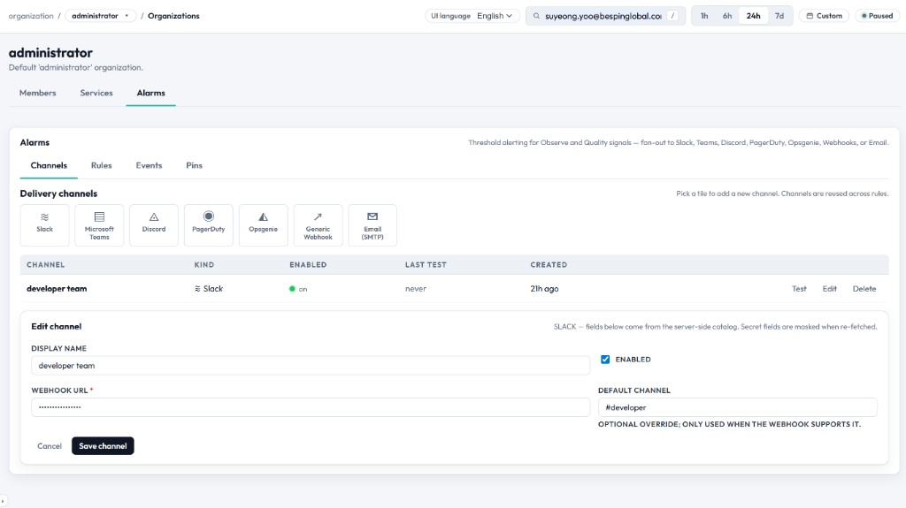

### Organizations & Members

Multi-tenant organization management with role-based access control (RBAC).

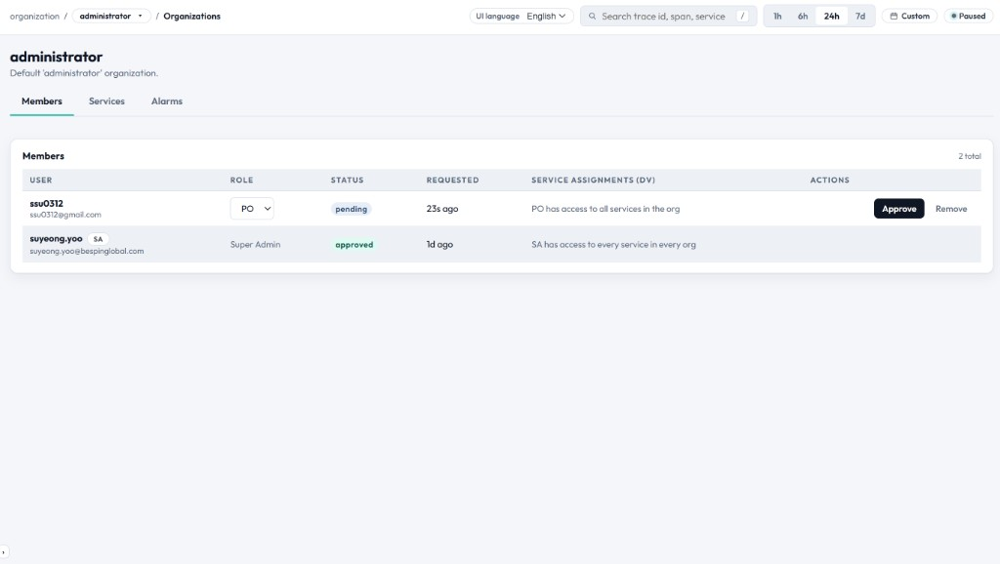

---

## Production Architecture

<p align="center">
  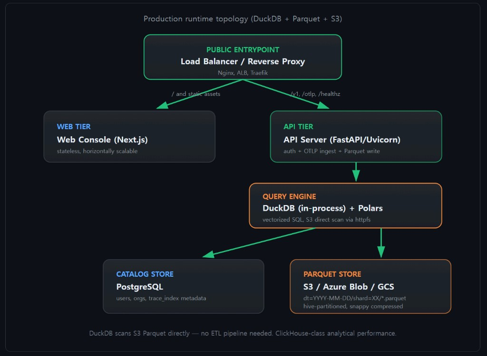
</p>

A single public entrypoint (Nginx, ALB, or Traefik) routes browser traffic to the **Web Console** and API paths (`/v1`, `/otlp`, `/healthz`) to the **API Server**.

**Horizontal scalability** — Both the Web tier (Next.js) and API tier (FastAPI/Uvicorn) are stateless. Add instances behind the load balancer to handle increasing transaction volume with no code changes.

**Tiered storage strategy:**

| Tier | Storage | Access Pattern |
|------|---------|----------------|
| **Hot** | Local filesystem or attached SSD | Active ingest, real-time queries on today's data |
| **Warm** | Blob Storage (Azure Blob, GCS) | Recent historical data, fast analytical queries via DuckDB |
| **Cold** | S3 (or S3-compatible) | Long-term retention, cost-optimized; DuckDB scans directly via httpfs — no ETL needed |

DuckDB operates in-process alongside the API server, scanning Parquet files across all tiers with column pruning and predicate pushdown. This delivers ClickHouse-class analytical performance without a separate data warehouse.

---

## Quick Start

### Requirements

- Python **3.11+**
- Node.js **20+** and npm
- Optional: [uv](https://docs.astral.sh/uv/) for venvs

### Windows (PowerShell)

```powershell
Copy-Item .env.sample .env
.\scripts\run-dev.ps1
```

### Linux / macOS

```bash
chmod +x scripts/run-dev.sh
cp .env.sample .env
./scripts/run-dev.sh
```

### URLs

| Service | URL |
|---------|-----|
| Web | http://localhost:3000 |
| API | http://127.0.0.1:8787 |
| OpenAPI | http://127.0.0.1:8787/docs |
| Health | http://127.0.0.1:8787/healthz |

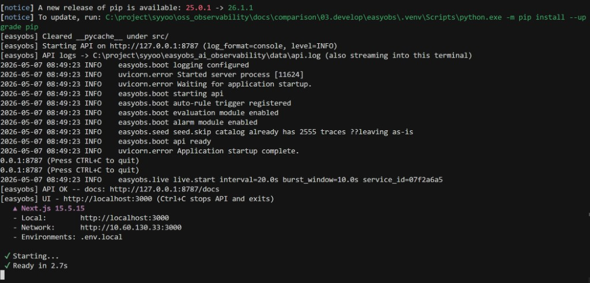

---

## Environment Variables

Copy `.env.sample` to `.env`. Key variables:

```bash
# Storage
EASYOBS_DATA_DIR=./data
EASYOBS_DATABASE_URL=                   # empty → SQLite, prod: postgresql+asyncpg://...

# HTTP
EASYOBS_API_HOST=127.0.0.1
EASYOBS_API_PORT=8787

# Auth
EASYOBS_JWT_SECRET=                     # empty → auto-generated

# Frontend
NEXT_PUBLIC_API_URL=http://127.0.0.1:8787

# Demo seed (first boot only)
EASYOBS_SEED_MOCK_DATA=false
```

Full list: [`src/easyobs/settings.py`](src/easyobs/settings.py) | [`.env.sample`](.env.sample)

---

## `easyobs_agent` SDK

Lightweight client (~15KB) + OpenTelemetry deps; sends traces via OTLP/HTTP.

```bash
pip install easyobs-agent
```

```python
from easyobs_agent import init, traced

init(
    "http://<easyobs-server>:8787",
    token="eobs_...",
    service="my-service",
)

@traced("my.operation")
def do_something(query: str) -> str:
    ...
```

---

## Open Source Acknowledgements

EasyObs is built on the shoulders of these open-source projects. Thank you.

### Backend (Python)

| Project | License | Link |
|---------|---------|------|
| FastAPI | MIT | https://github.com/fastapi/fastapi |
| Uvicorn | BSD-3 | https://github.com/encode/uvicorn |
| SQLAlchemy | MIT | https://github.com/sqlalchemy/sqlalchemy |
| Pydantic | MIT | https://github.com/pydantic/pydantic |
| DuckDB | MIT | https://github.com/duckdb/duckdb |
| Polars | MIT | https://github.com/pola-rs/polars |
| PyArrow (Apache Arrow) | Apache-2.0 | https://github.com/apache/arrow |
| OpenTelemetry Python | Apache-2.0 | https://github.com/open-telemetry/opentelemetry-python |
| HTTPX | BSD-3 | https://github.com/encode/httpx |
| PyJWT | MIT | https://github.com/jpadilla/pyjwt |
| Argon2-cffi | MIT | https://github.com/hynek/argon2-cffi |
| openpyxl | MIT | https://github.com/theorchard/openpyxl |

### Frontend (TypeScript)

| Project | License | Link |
|---------|---------|------|
| Next.js | MIT | https://github.com/vercel/next.js |
| React | MIT | https://github.com/facebook/react |
| TanStack Query | MIT | https://github.com/TanStack/query |
| TypeScript | Apache-2.0 | https://github.com/microsoft/TypeScript |

### Cloud & LLM Integrations

| Project | License | Link |
|---------|---------|------|
| Boto3 (AWS SDK) | Apache-2.0 | https://github.com/boto/boto3 |
| Azure Storage Blob | MIT | https://github.com/Azure/azure-sdk-for-python |
| Google Cloud Storage | Apache-2.0 | https://github.com/googleapis/python-storage |
| OpenAI Python | MIT | https://github.com/openai/openai-python |
| Anthropic Python | MIT | https://github.com/anthropics/anthropic-sdk-python |

---

## License

MIT License — free for personal, commercial, and enterprise use without restriction.

See [`LICENSE`](./LICENSE) for details.

---

## Contact

**Suyeong Yoo** — ssu0416@gmail.com

---

Production deployment: see [`setup/README.md`](setup/README.md) (Terraform, Compose, air-gapped).
